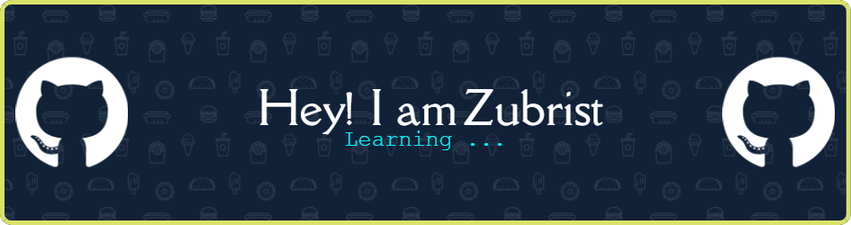

<header align="left">
  

- 👋 Hi, I’m @zubrist
- 👀 I’m deeply interested in continuous learning and exploring new technologies.
- 🌱 I’m currently focused on developing robust and scalable web applications.
- 💞️ I’m looking to collaborate on something cool
- 📫 Reach me at [LinkedIn](https://www.linkedin.com/in/akhlakh-ahmed-reja)

### 🛠️ Languages and Tools

  

<!-- 
-->

---
<!--
### 📈 GitHub Stats

  

  

-->
---
<!-- WakaTime Stats 

-->
### 🧭 My Dev Journey

